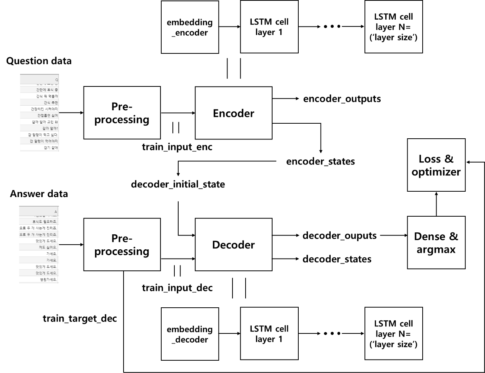

# Seq2seq+attention

# Model structure
  

# Learning Data
Title|Contents|Other
--|--|--
데이터 이름|Chatbot data
데이터 용도|한국어 챗봇  학습을 목적으로 사용한다.
데이터 권한|MIT 라이센스
데이터 출처|https://github.com/songys/Chatbot_data (송영숙님)

# Requirement
Numpy==1.16.3
-U scikit-learn==0.20.3 
KoNLPy==0.5.1
Scipy==1.2.1
Pandas==0.24.2
NLTK==3.4.3
Pandas==0.24.2
Rouge==0.3.2
Tensorflow-gpu==1.14.0 

# Project Structure
    .
    ├── data_in                     # 데이터가 존재하는 영역
        ├── ChatBotData.csv         # 전체 데이터
        ├── README.md               # 데이터 저자 READMD 파일
    ├── data_out                    # 출력 되는 모든 데이터가 모이는 영역
        ├── vocabularyData.voc      # 사전 파일
        ├── check_point             # check_point 저장 공간
    ├── configs.py                  # 모델 설정에 관한 소스
    ├── data.py                     # data 전처리 및 모델에 주입되는 data set 만드는 소스
    ├── main.py                     # 전체적인 프로그램이 시작되는 소스
    ├── model.py                    # 모델이 들어 있는 소스
    └── predict.py                  # 학습된 모델로 실행 해보는 소스   

# Reference
Title|Contents
--|--
Data|[Chatbot data](https://github.com/songys/Chatbot_data)  
Paper|[Learning Phrase Representations using RNN Encoder-Decoder for Statistical Machine Translation](https://arxiv.org/pdf/1406.1078.pdf)  
Paper|[Neural Machine Translation by Jointly Learning to Align and Translate](https://arxiv.org/abs/1409.0473.pdf)
